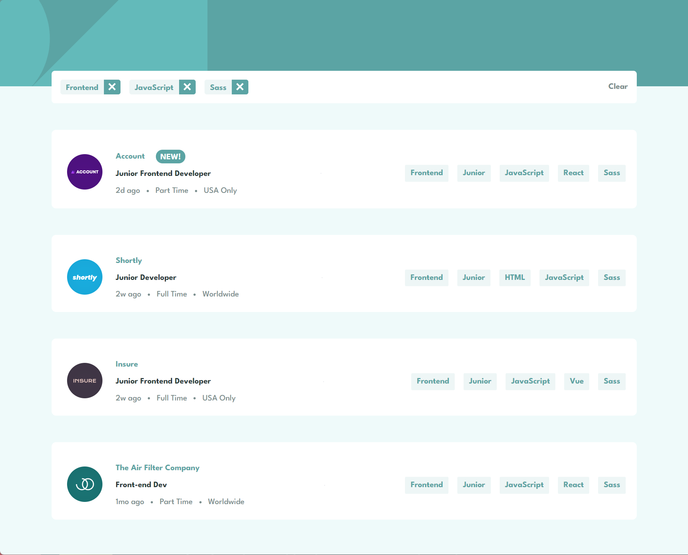

# Job Listings

This is a simple Job Listings site built using HTML, Tailwind CSS, and JavaScript

## Screenshots

## Live Site

Check out the live site [here](https://job-l1stings.netlify.app/).

## Features

- Browse a diverse range of job listings for various technology stacks.
- Filter job listings based on specific skills and technologies.

## Installation

1. Clone the repository: `git clone https://github.com/your-username/job-listings.git`
2. Navigate to the project directory: `cd job-listings`
3. Install the dependencies: `npm install`
4. Start the development server: `npm run dev`
5. Open your web browser and visit `http://localhost:3000` (or the specified port)

## Contributing

Contributions are welcome! If you would like to contribute to this project, please follow these steps:

1. Fork the repository.
2. Create a new branch for your feature or bug fix.
3. Commit your changes.
4. Push your branch to your forked repository.
5. Submit a pull request.

## License

This project is licensed under the [MIT License](LICENSE).
